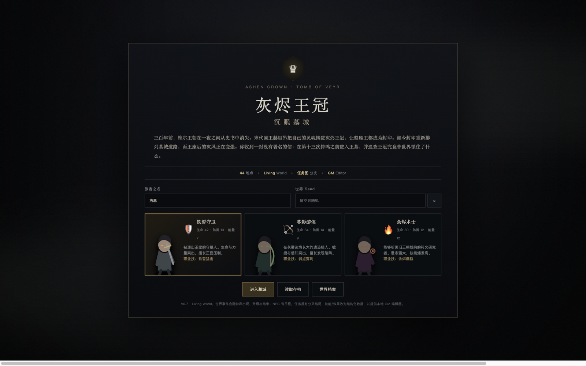
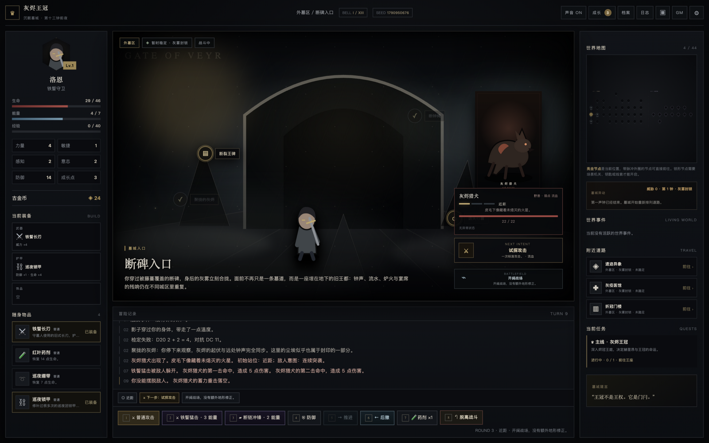
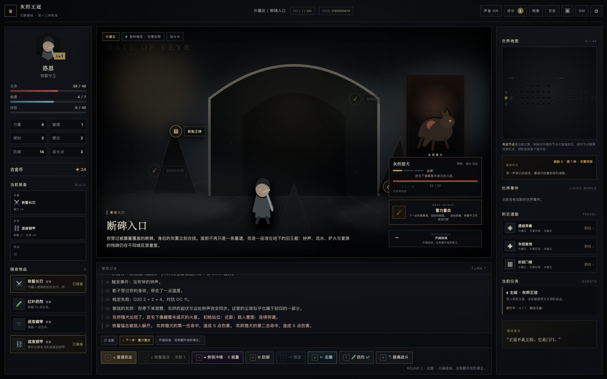
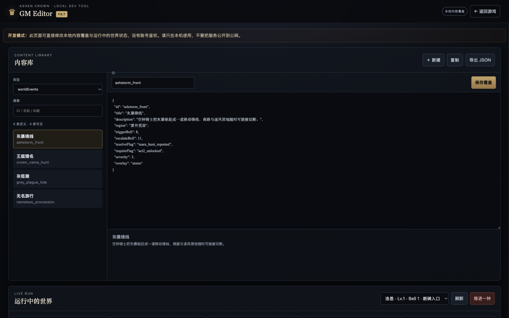

<div align="center">

# ♛ 灰烬王冠：沉眠墓城

**Ashen Crown · Tomb of Veyr**

一个单进程、零依赖、开箱即用的本地 Dungeon / TRPG RPG —
内置 Living World 运行时、意图制战斗、分支任务图、GM 编辑器，以及一套供 AI Agent 使用的受控工具网关。

[快速开始](#-快速开始) · [游戏特性](#-游戏特性) · [GM-Editor](#-gm-editor) · [AI--Agent-接入](#-ai--agent-接入) · [架构](#-架构)



</div>

---

## ✨ 这是什么

三百年前，维尔王朝在一夜之间从史书中消失。末代国王赫里昂把自己的灵魂铸进灰烬王冠，让整座王都成为封印。如今封印重新排列墓城道路，而王座后的灰风正在变强。你收到一封没有署名的信：在第十三次钟鸣之前进入王墓，追查王冠究竟替世界锁住了什么。

**灰烬王冠** 是一个完整可玩的黑暗奇幻地城 RPG，同时也是一个 **Living World Runtime**：

- 🎮 **开箱即玩** — 单个 Go 二进制 + 静态前端，不需要数据库、不需要 Node/npm、不需要安装任何依赖；
- 🌍 **活的世界** — 世界事件随钟声出现、升级与消解；NPC 拥有结构化日程与心情；区域状态持续演变；
- ⚔️ **意图制战斗** — 敌人下一步行动可见，近 / 中 / 远三档距离与战场地形、危险带共同构成决策空间；
- 🗺️ **分支任务图** — 支线拥有真正的分叉结局，选择会永久写入世界状态；
- 🛠️ **本地 GM Editor** — 在浏览器里查看、编辑、覆盖所有游戏内容，并实时操控运行中的世界；
- 🤖 **AI-ready** — 19 个受控 Agent Tool + JSON Schema 校验 + dry-run + 审计日志，通过 HTTP 或 MCP 接入任意 LLM，但世界事实永远由游戏运行时裁决。

> 本项目**不绑定任何 LLM**。不接 AI 也能完整通关：规则校验、随机数、任务状态、NPC 位置和战斗结果全部由本地 Game Runtime 决定。AI 只被允许通过受控工具操作这个世界。

---

## 📸 游戏画面

| 探索 | 战斗 |
|:---:|:---:|
|  |  |

**场景探索** — 点击场景热点调查、检定；NPC 立绘对话；右侧世界地图与实时世界事件面板。

**意图制战斗** — 敌人 NEXT INTENT 提前可见；技能按职业动态生成；距离、地形与危险带叠加进决策。

<div align="center">
<br>
<sub>GM Editor — 内容库、Live Run 操控与 NPC 调度，全部通过受控 HTTP API 完成</sub>
</div>

---

## 🚀 快速开始

### 从源码运行（推荐）

需要 Go 1.23+：

```bash
git clone https://github.com/lsl1016/ashen-crown-dungeon.git
cd ashen-crown-dungeon
go run ./cmd/server -web ./web -data ./data
```

打开 <http://localhost:8080> 即可开始游戏。

### Docker

```bash
docker compose up --build
```

### 预编译包

各平台解压即玩，无需安装 Go / Node / npm：

```bash
# Windows：双击 start-windows.bat
# Linux
chmod +x start-linux.sh dist/ashen-crown-linux-amd64 && ./start-linux.sh
# macOS (Apple Silicon)
chmod +x start-macos-arm64.sh dist/ashen-crown-macos-arm64 && ./start-macos-arm64.sh
```

| 入口 | 地址 |
| --- | --- |
| 游戏 | <http://localhost:8080> |
| GM Editor | <http://localhost:8080/editor> |
| Agent Tool Gateway | `GET /api/agent/tools` · `POST /api/agent/tools/execute` |
| MCP Server | `POST /mcp` |

---

## 🎮 游戏特性

### Living World

世界不止通过剧情 Flag 变化 — 结构化的世界事件按钟声调度：

```text
第 4 钟 ──► 灰疫潮出现 ──► 外墓区进入 plague 状态
                                │
              NPC 行动 / 区域描述 / 战斗危险带随之改变
                                │
第 7 钟仍未解决 ──► 事件升级 ──► 玩家完成对应任务分支
                                │
                    世界事件结束并留下持久后果
```

- **世界事件**：灰疫潮、无名游行、王庭猎名、灰暴锋线 — 每个都带 `triggerBell / escalateBell / severity / overlay` 等结构化定义；
- **NPC 日程**：伊文会随钟声在断桥营火与灰疫医馆之间行动，任务结果还会改变其最终去向；GM 可临时固定 NPC 位置，也可恢复自动日程；
- **场景状态**：每个房间派生 `stable / secured / danger / plague / echo / blackfire / storm` 状态，前端据真实状态切换环境 Overlay、粒子与光效。

### 意图制战斗

战斗不是纯数值对撞。每个回合你需要综合：

```text
敌人 NEXT INTENT      连续突袭？重击？诅咒？
近 / 中 / 远距离       推进 / 后撤 / 卡距离
Battlefield Terrain   断柱掩体防御 +2、黑水侵蚀每回合掉血
装备词条 & 职业天赋     Build 决定打法
技能 Cost / Cooldown / Range
```

职业技能是纯数据定义的 Skill / Effect 结构，新增 `heal / poison / summon / teleport` 等效果只需扩展 Effect Runtime，不需要为每个技能重写战斗流程：

```json
{
  "id": "warden_chainbreaker",
  "class": "warden",
  "name": "断链冲锋",
  "cost": 2,
  "cooldown": 3,
  "minDistance": 1,
  "maxDistance": 3,
  "effects": [
    { "type": "set_distance", "value": 1 },
    { "type": "damage", "value": 4, "dice": 6 },
    { "type": "enemy_status", "target": "weakened", "rounds": 2 }
  ]
}
```

### 分支任务图

三条主要支线从单线任务升级为 `QuestGraph`，选择会真实影响 NPC 关系、区域状态、世界事件走向与结局叙事：

```text
              ┌→ 公开赛勒记录 → 重建巡夜哨线
巡夜队任务 ──┤
              └→ 封存记录     → 表面秩序保留 / 真相消失

              ┌→ 归还真名 → 无名游行开始恢复姓名
无名囚徒 ─────┤
              └→ 重新封名 → 游行停止 / 真名再次被抹去
```

### 内容规模

```text
44   地图地点          21   类敌人 / Boss      6    个数据驱动职业技能
133  场景交互元素      48   种物品             5    个持久 NPC
35   剧情 / 随机事件    18   个职业天赋          3    棵分支 QuestGraph
8    种装备词条        5    套 NPC 日程         4    个 Living World Event
2    套动态商店        7    个持续变化区域      104  个本地 SVG 资源
```

---

## 🛠️ GM Editor

访问 <http://localhost:8080/editor> — 本地开发与内容创作的控制台。

**内容库** — 查看、搜索、新建、复制并覆盖 `Item / Enemy / Event / NPC / Dialogue / Shop / Skill / WorldEvent / NPCSchedule / QuestGraph`。覆盖保存在 `data/editor/content_overrides.json`，服务重启后自动重载，无需重新编译。QuestGraph 自带节点预览。

**Live Run** — 直接操控本地正在运行的世界：推进世界钟、强制触发世界事件、移动 NPC、修改区域状态、设置世界 Flag、查看 NPC 当前行为与真实 Flag。

**地点编辑器** — 编辑或新建 Room、指定地图坐标与 Zone / Scene / Type、添加场景元素、把新地点接入已有地图，并查看当前 Run 的实时小地图。

> ⚠️ GM Editor 没有身份认证，只设计给本机开发使用，不要把服务直接暴露到公网。

---

## 🤖 AI / Agent 接入

未来的 DM Agent 不允许直接修改源码或存档 JSON — 它只能通过受控工具操作世界，所有世界事实由 Game Runtime 校验和裁决：

```text
玩家自然语言
    ↓
DM Agent（任意 LLM）
    ↓
读取真实 Run / World State        ← inspect_* / search_catalog
    ↓
结构化意图 / Tool Call            ← JSON Schema 校验 + dry-run
    ↓
Game Runtime 校验与执行           ← 同 Run 串行锁
    ↓
Run / World State 改变            →  JSONL 审计日志
    ↓
前端表现
```

**19 个受控 Agent Tool：**

```text
世界检视   inspect_world · inspect_room · inspect_npc · inspect_quest ·
           inspect_combat · list_world_events · recent_log · search_catalog
世界操作   create_room · connect_rooms · reveal_room · set_flag ·
           set_region_state · spawn_enemy · grant_item · move_npc ·
           trigger_world_event · advance_bell
规则模拟   roll_check
```

通过 HTTP 调用：

```bash
curl -X POST http://localhost:8080/api/agent/tools/execute \
  -H "Content-Type: application/json" \
  -d '{
    "tool": "spawn_enemy",
    "arguments": { "runId": "run_xxx", "enemyId": "ash_hound", "reason": "桥上遭遇战" }
  }'
```

或通过 MCP（Streamable HTTP，`POST /mcp`）接入任何支持 MCP 的客户端。通用网关可以用 `POST /api/agent/tools/call/{name}` 把每个工具注册为独立 MCP Tool。

**安全建议** — 公网部署必须设置：

```bash
export ASHEN_AGENT_TOKEN="replace-with-a-long-random-secret"
export ASHEN_AGENT_REQUIRE_REASON="true"
```

配套的 Agent Skills（DM、世界导演、遭遇裁判）在 [`skills/`](skills/README.md)，接入示例在 [`examples/`](examples/)，完整规范见 [`docs/AI_GM_GUIDE.md`](docs/AI_GM_GUIDE.md) 与 [`docs/MCP_SERVER.md`](docs/MCP_SERVER.md)。

---

## 🏗️ 架构

单一 Go 进程承载全部逻辑；前端只做表现，永不回写世界事实：

```text
┌────────────────────────────────────────────────┐
│  web/  静态前端（游戏 + GM Editor，原生 JS）        │
│        表现层：实体移动 / VFX / 浮动数字 / 演出      │
└───────────────────▲────────────────────────────┘
                    │ HTTP (JSON)
┌───────────────────┴────────────────────────────┐
│  internal/httpapi     HTTP API · Agent Gateway   │
│                      · MCP Server               │
├────────────────────────────────────────────────┤
│  internal/agentgateway  串行锁 · dry-run · 审计   │
├────────────────────────────────────────────────┤
│  internal/game        Game Runtime（唯一事实源）   │
│    engine.go          规则执行                    │
│    content*.go        数据驱动内容定义             │
│    generator.go       种子化地图生成              │
│    systems*.go        战斗 / 任务 / 世界事件 / NPC  │
│    tools.go           GM 与 Agent 共用的受控工具    │
├────────────────────────────────────────────────┤
│  data/  JSON 存档（runs / saves / 内容覆盖）        │
└────────────────────────────────────────────────┘
```

核心原则：**代码定义能力，数据定义世界，AI 只能通过受控工具操作两者。**

```text
ashen-crown-dungeon/
├── cmd/server/          # 入口；cmd/schemaexport 导出 JSON Schema
├── internal/game/       # Game Runtime：引擎、内容、生成器、系统、工具
├── internal/httpapi/    # HTTP API、Agent Gateway、MCP Server
├── internal/agentgateway/  # 串行锁、dry-run、审计
├── web/                 # 静态前端 + 104 个本地 SVG 资源
├── docs/                # 设计文档、系统文档、JSON Schema
├── skills/              # 打包的 Agent Skills（DM / 世界导演 / 遭遇裁判）
├── examples/            # Agent 接入示例
└── data/                # 运行数据：runs、saves、内容覆盖
```

### HTTP API 一览

```text
# 游戏
GET  /api/health                 GET  /api/world
POST /api/runs                   GET  /api/runs/{id}
POST /api/runs/{id}/move         POST /api/runs/{id}/interact
POST /api/runs/{id}/action       POST /api/runs/{id}/combat
POST /api/runs/{id}/item         POST /api/runs/{id}/npc
POST /api/runs/{id}/dialogue     POST /api/runs/{id}/shop
POST /api/runs/{id}/growth       POST /api/runs/{id}/talent
POST /api/runs/{id}/save         POST /api/runs/{id}/tools/execute
GET  /api/saves                  POST /api/saves/{id}/load

# Agent
GET  /api/agent/tools            GET  /api/agent/tools/{name}
POST /api/agent/tools/execute    POST /api/agent/tools/call/{name}
GET  /api/agent/audit            POST /mcp

# GM Editor
GET  /api/editor/content         GET  /api/editor/overrides
GET  /api/editor/runs            POST /api/editor/content
POST /api/editor/runs/{id}/world POST /api/editor/runs/{id}/room
```

---

## 📚 文档

| 文档 | 内容 |
| --- | --- |
| [docs/GAME_DESIGN.md](docs/GAME_DESIGN.md) | 游戏设计：职业、战斗、成长、装备词条 |
| [docs/WORLD.md](docs/WORLD.md) | 世界观设定与双幕战役结构 |
| [docs/ARCHITECTURE.md](docs/ARCHITECTURE.md) | 技术架构与分层设计 |
| [docs/AI_INTEGRATION.md](docs/AI_INTEGRATION.md) | AI 接入原则与边界 |
| [docs/AI_GM_GUIDE.md](docs/AI_GM_GUIDE.md) | Agent Tool 使用指南 |
| [docs/MCP_SERVER.md](docs/MCP_SERVER.md) | MCP Server 说明 |
| [docs/MCP_TOOL_REGISTRATION.md](docs/MCP_TOOL_REGISTRATION.md) | 通用网关工具注册 |
| [skills/README.md](skills/README.md) | 打包 Agent Skills 说明 |

---

## 🗺️ 方向

- 更多 Effect 类型（heal / poison / summon / teleport / push / pull）与职业技能
- 更多区域、世界事件与 QuestGraph 分支
- 前端表现升级（引擎化渲染），HTTP API 与 Runtime 保持稳定迁移
- DM Agent 实机接入示例与评测脚本

## 🤝 参与贡献

欢迎 Issue 与 PR：内容定义（物品 / 敌人 / 事件 / 任务图）、Effect Runtime 扩展、前端表现、文档改进都是很好的切入点。GM Editor 可以直接以 JSON 覆盖的形式试验新内容，改起来不需要写 Go。

## ⚠️ 安全须知

- 本项目设计为**本地运行**：GM Editor 与 Agent Gateway 默认无鉴权；
- 公网部署必须设置 `ASHEN_AGENT_TOKEN`，或在反向代理层做认证与限流；
- 存档为本地 JSON 文件，请自行做好备份。
